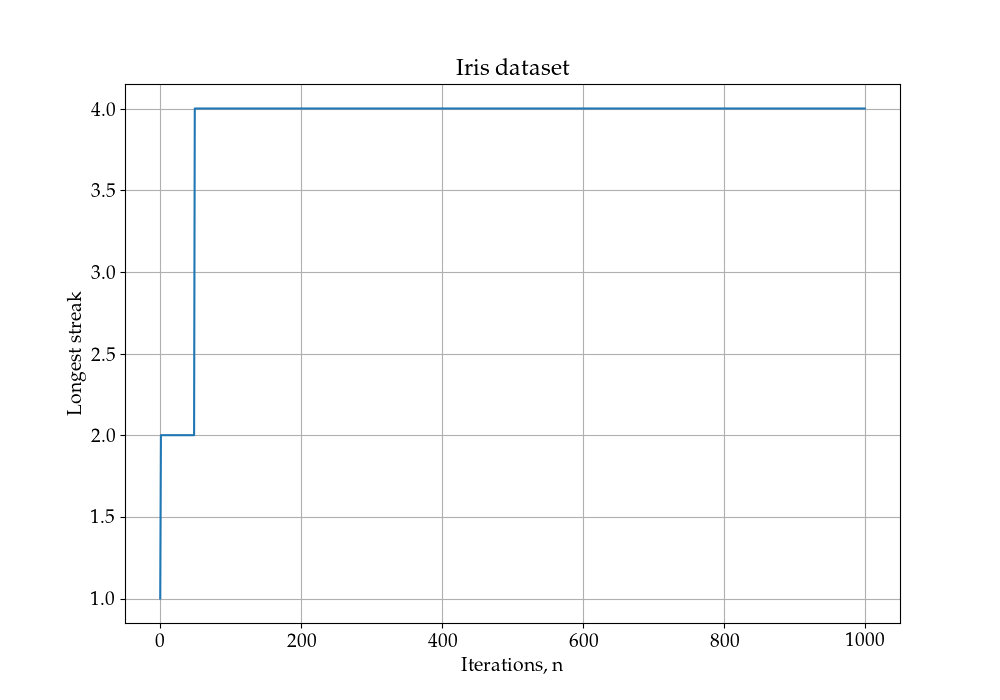
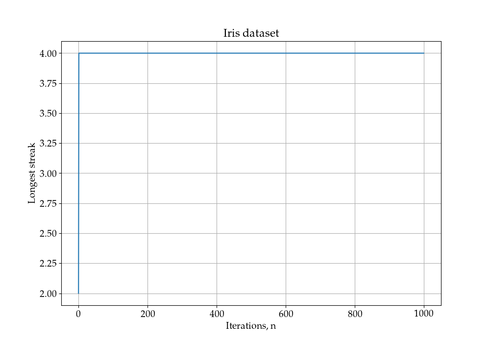
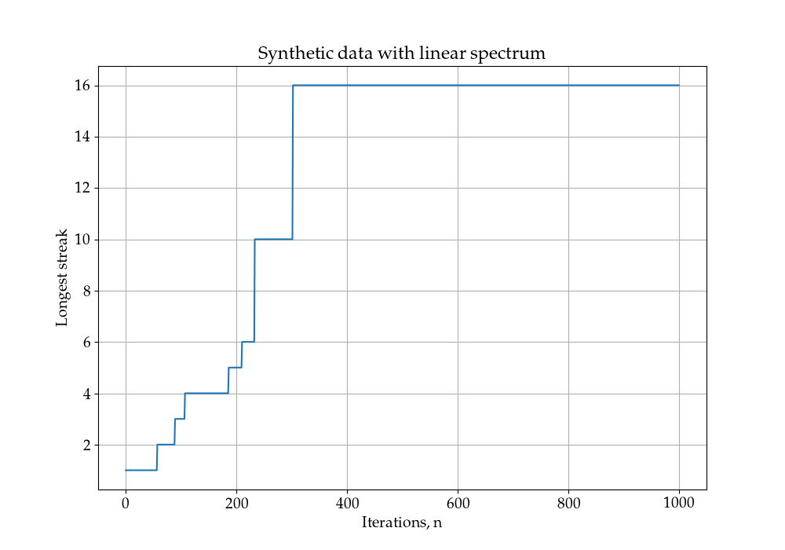
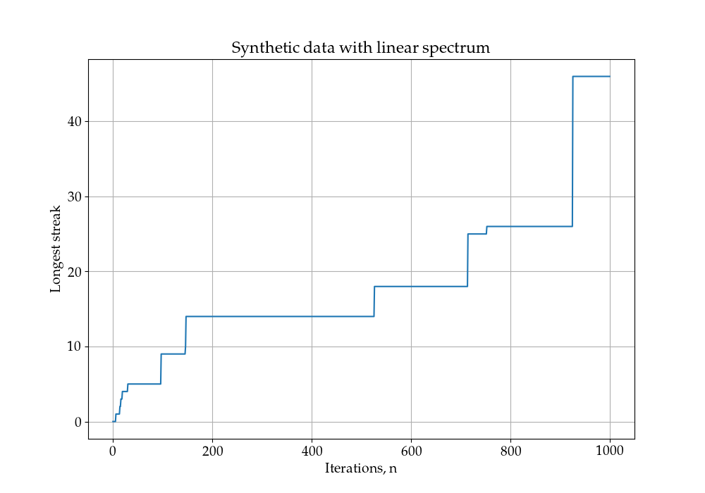
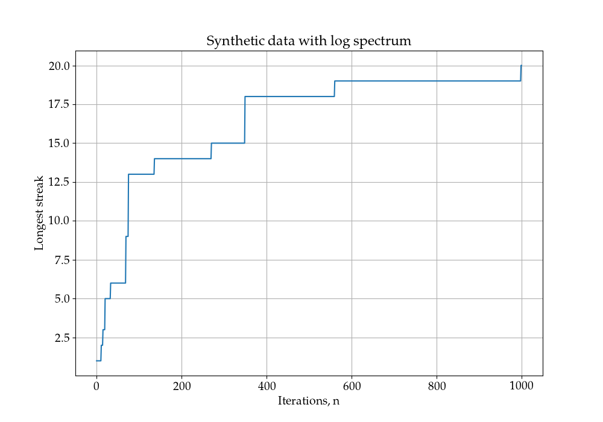
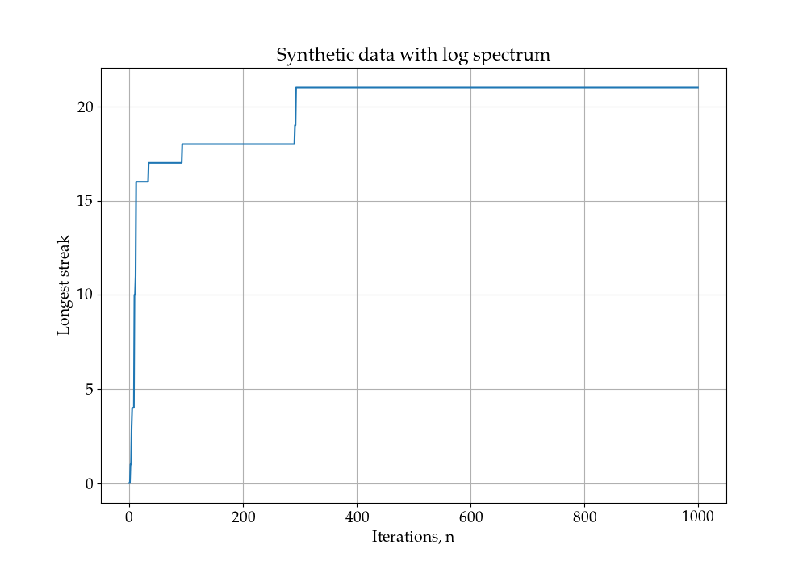
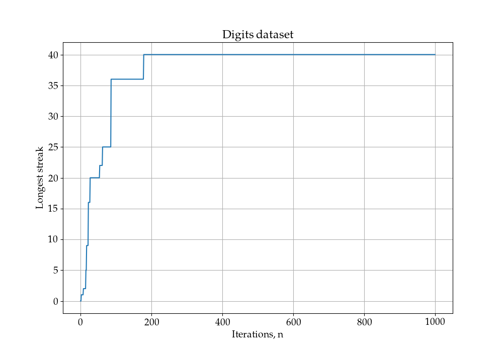
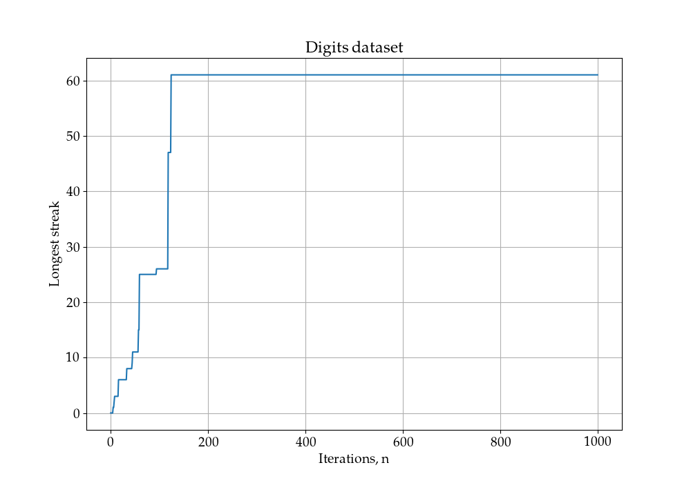

# PCA as an EigenGame

Final project on course "**N**umerical **L**inear **A**lgebra", Skoltech 2020

# Description

In this project PCA problem was considered as a competitive game in which each approximate eigenvector is controlled by a player whose goal is to maximize their own utility function.

# Authors

### Team **KENA**:

- Elvira Plumite
- Nina Konovalova
- Ekaterina Radionova
- Albina Klepach

# Results

## Iris dataset

This [data](https://scikit-learn.org/stable/auto_examples/datasets/plot_iris_dataset.html) sets consists of 3 different types of irises’ (Setosa, Versicolour, and Virginica). The rows being the samples and the columns being: Sepal Length, Sepal Width, Petal Length and Petal Width.

EigenGame | Oja
-|-
 | 

## Synthetic dataset with linear spectrum

Orthogonal matrix V is initialized randomly so that squared matrix M with size 50 is constructed as a diagonal matrix without loss of generality. The linear spectrum ranges from 1 to 1000 with equal spacing.

EigenGame | Oja
-|-
 | 

## Synthetic dataset with log spectrum

Orthogonal matrix V is initialized randomly so that squared matrix M with size 50 is constructed as a diagonal matrix without loss of generality. The exponential spectrum ranges from 1000 to 1 with equal spacing on the exponents.

EigenGame | Oja
-|-
 | 

## Digits dataset

Each datapoint in [dataset](https://scikit-learn.org/stable/modules/generated/sklearn.datasets.load_digits.html) is a 8x8 image of a digit.

EigenGame | Oja
-|-
 | 

# Usage

# References

- [EigenGame: PCA as a Nash Equilibrium](https://openreview.net/forum?id=NzTU59SYbNq)